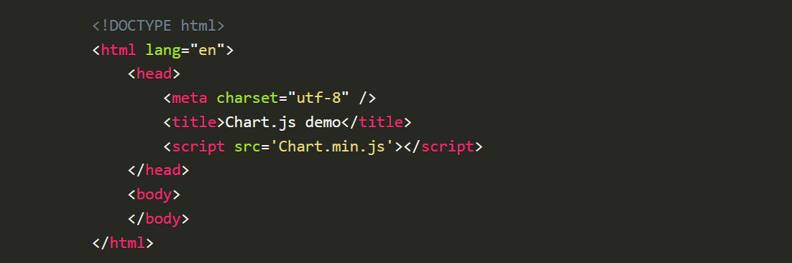
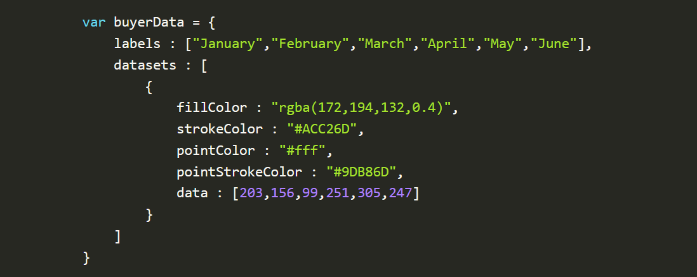
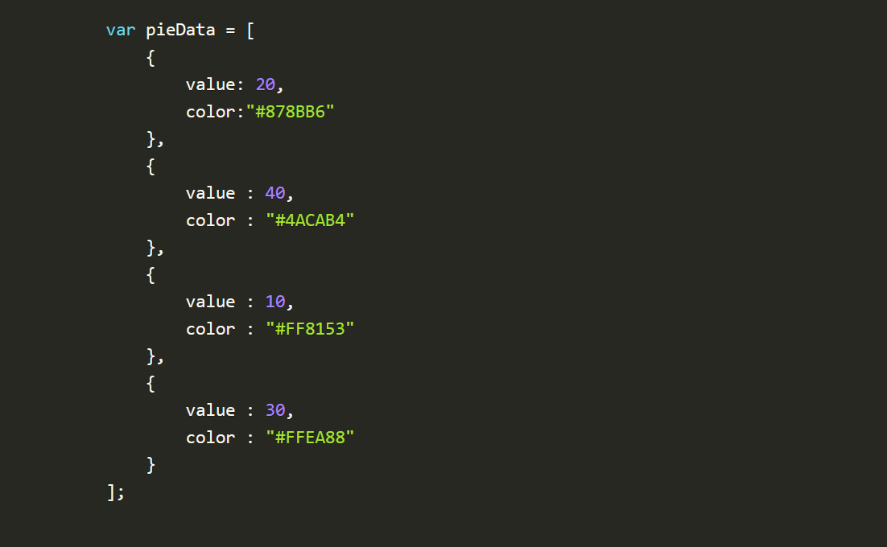
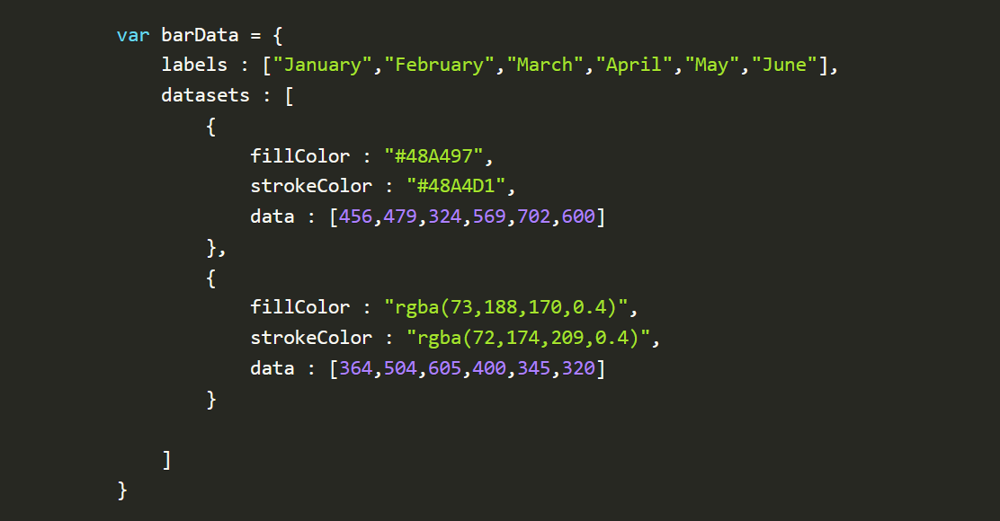

# Docs for the HTML `<canvas>` Element & Chart.js

## Charts

Charts are far better for displaying data visually than tables and have the added benefit that no one is ever going to press-gang them into use as a layout tool. They’re easier to look at and convey data quickly, but they’re not always easy to create.

A great way to get started with charts is with Chart.js, a JavaScript plugin that uses HTML5’s canvas element to draw the graph onto the page. It’s a well documented plugin that makes using all kinds of bar charts, line charts, pie charts and more, incredibly easy.

### Setting up

The first thing we need to do is download Chart.js. Copy the Chart.min.js out of the unzipped folder and into the directory you’ll be working in. Then create a new html page and import the script.

### Drawing a line chart

To draw a line chart, the first thing we need to do is create a canvas element in our HTML in which Chart.js can draw our chart.

Inside the same script tags we need to create our data, in this instance it’s an object that contains labels for the base of our chart and datasets to describe the values on the chart.

### Drawing a pie chart

Our line chart is complete, so let’s move on to our pie chart.

We need to create the data. This data is a little different to the line chart because the pie chart is simpler, we just need to supply a value and a color for each section:

### Drawing a bar chart

Finally, let’s add  a bar chart to our page. Happily the syntax for the bar chart is very similar to the line chart we’ve already added.

