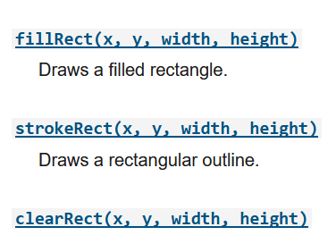
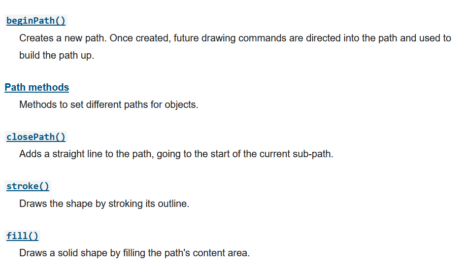
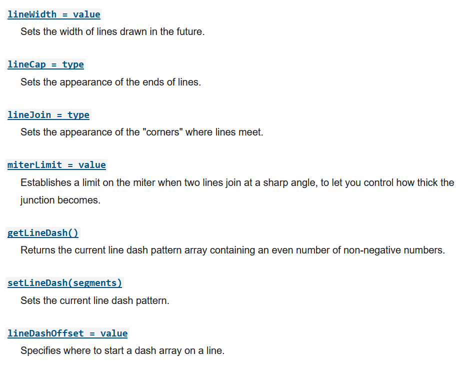
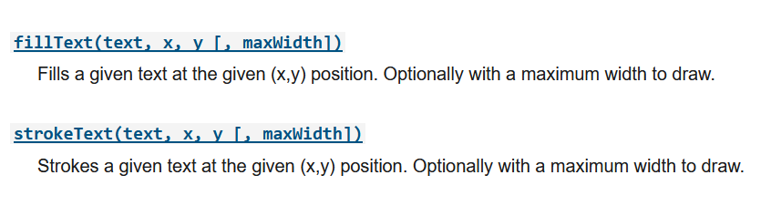

# Docs for the HTML `<canvas>` Element & Chart.js

## Charts

Charts are far better for displaying data visually than tables and have the added benefit that no one is ever going to press-gang them into use as a layout tool. They’re easier to look at and convey data quickly, but they’re not always easy to create.

A great way to get started with charts is with Chart.js, a JavaScript plugin that uses HTML5’s canvas element to draw the graph onto the page. It’s a well documented plugin that makes using all kinds of bar charts, line charts, pie charts and more, incredibly easy.

### Setting up

The first thing we need to do is download Chart.js. Copy the Chart.min.js out of the unzipped folder and into the directory you’ll be working in. Then create a new html page and import the script.

### Drawing a line chart

To draw a line chart, the first thing we need to do is create a canvas element in our HTML in which Chart.js can draw our chart.

Inside the same script tags we need to create our data, in this instance it’s an object that contains labels for the base of our chart and datasets to describe the values on the chart.

### Drawing a pie chart

Our line chart is complete, so let’s move on to our pie chart.

We need to create the data. This data is a little different to the line chart because the pie chart is simpler, we just need to supply a value and a color for each section:

### Drawing a bar chart

Finally, let’s add  a bar chart to our page. Happily the syntax for the bar chart is very similar to the line chart we’ve already added.

## The `<canvas>` element

At first sight a `<canvas>` looks like the `` element, with the only clear difference being that it doesn't have the src and alt attributes. Indeed, the `<canvas>` element has only two attributes, width and height. These are both optional and can also be set using DOM properties. When no width and height attributes are specified, the canvas will initially be 300 pixels wide and 150 pixels high. The element can be sized arbitrarily by CSS, but during rendering the image is scaled to fit its layout size: if the CSS sizing doesn't respect the ratio of the initial canvas, it will appear distorted.

### Fallback content

The `<canvas>` element differs from an `` tag in that, like for `<video>`, `<audio>`, or `<picture>` elements, it is easy to define some fallback content, to be displayed in older browsers not supporting it, like versions of Internet Explorer earlier than version 9 or textual browsers. You should always provide fallback content to be displayed by those browsers.

### Required `</canvas>` tag

As a consequence of the way fallback is provided, unlike the `` element, the `<canvas>` element requires the closing tag (`</canvas>`). If this tag is not present, the rest of the document would be considered the fallback content and wouldn't be displayed.

### The rendering context

The `<canvas>` element creates a fixed-size drawing surface that exposes one or more rendering contexts, which are used to create and manipulate the content shown. In this tutorial, we focus on the 2D rendering context. Other contexts may provide different types of rendering; for example, WebGL uses a 3D context based on OpenGL ES.

## The grid

Before we can start drawing, we need to talk about the canvas grid or coordinate space. Our HTML skeleton from the previous page had a canvas element 150 pixels wide and 150 pixels high.

### Drawing rectangles

Unlike SVG, `<canvas>` only supports two primitive shapes: rectangles and paths (lists of points connected by lines). All other shapes must be created by combining one or more paths. Luckily, we have an assortment of path drawing functions which make it possible to compose very complex shapes.

### Drawing paths

Now let's look at paths. A path is a list of points, connected by segments of lines that can be of different shapes, curved or not, of different width and of different color. A path, or even a subpath, can be closed.

## Applying styles and colors

### Colors

Up until now we have only seen methods of the drawing context. If we want to apply colors to a shape, there are two important properties we can use: fillStyle and strokeStyle.

### Transparency

In addition to drawing opaque shapes to the canvas, we can also draw semi-transparent (or translucent) shapes. This is done by either setting the globalAlpha property or by assigning a semi-transparent color to the stroke and/or fill style.

### Line styles

## Drawing text

