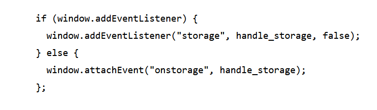

# Local Storage

ersistent local storage is one of the areas where native client applications have held an advantage over web applications. For native applications, the operating system typically provides an abstraction layer for storing and retrieving application-specific data like preferences or runtime state. These values may be stored in the registry, INI files, XML files, or some other place according to platform convention. If your native client application needs local storage beyond key/value pairs, you can embed your own database, invent your own file format, or any number of other solutions.

## A Brief History of Local Storage Hacks Before HTML5

In the beginning, there was only Internet Explorer. Or at least, that’s what Microsoft wanted the world to think. To that end, as part of the First Great Browser Wars, Microsoft invented a great many things and included them in their browser-to-end-all-browser-wars, Internet Explorer. One of these things was called DHTML Behaviors, and one of these behaviors was called userData.

userData allows web pages to store up to 64 KB of data per domain, in a hierarchical XML-based structure. (Trusted domains, such as intranet sites, can store 10 times that amount. And hey, 640 KB ought to be enough for anybody.) IE does not present any form of permissions dialog, and there is no allowance for increasing the amount of storage available.

In 2007, Google launched Gears, an open source browser plugin aimed at providing additional capabilities in browsers. (We’ve previously discussed Gears in the context of providing a geolocation API in Internet Explorer.) Gears provides an API to an embedded SQL database based on SQLite. After obtaining permission from the user once, Gears can store unlimited amounts of data per domain in SQL database tables.

In the meantime, Brad Neuberg and others continued to hack away on dojox.storage to provide a unified interface to all these different plugins and APIs. By 2009, dojox.storage could auto-detect (and provide a unified interface on top of) Adobe Flash, Gears, Adobe AIR, and an early prototype of HTML5 storage that was only implemented in older versions of Firefox.

## Introducing HTML5 Storage

What I will refer to as “HTML5 Storage” is a specification named Web Storage, which was at one time part of the HTML5 specification proper, but was split out into its own specification for uninteresting political reasons. Certain browser vendors also refer to it as “Local Storage” or “DOM Storage.” The naming situation is made even more complicated by some related, similarly-named.

## Using HTML5 Storage

HTML5 Storage is based on named key/value pairs. You store data based on a named key, then you can retrieve that data with the same key. The named key is a string. The data can be any type supported by JavaScript, including strings, Booleans, integers, or floats. However, the data is actually stored as a string. If you are storing and retrieving anything other than strings, you will need to use functions like parseInt() or parseFloat() to coerce your retrieved data into the expected JavaScript datatype.

## Tracking Changes to the HTML5 Storage Area

If you want to keep track programmatically of when the storage area changes, you can trap the storage event. The storage event is fired on the window object whenever setItem(), removeItem(), or clear() is called and actually changes something. For example, if you set an item to its existing value or call clear() when there are no named keys, the storage event will not fire, because nothing actually changed in the storage area.

## HTML5 Storage in Action

Let’s see HTML5 Storage in action. Recall the Halma game we constructed in the canvas chapter. There’s a small problem with the game: if you close the browser window mid-game, you’ll lose your progress. But with HTML5 Storage, we can save the progress locally, within the browser itself. Here is a live demonstration. Make a few moves, then close the browser tab, then re-open it. If your browser supports HTML5 Storage, the demonstration page should magically remember your exact position within the game, including the number of moves you’ve made, the position of each of the pieces on the board, and even whether a particular piece is selected.

## Beyond Named Key-Value Pairs: Competing Visions

While the past is littered with hacks and workarounds, the present condition of HTML5 Storage is surprisingly rosy. A new API has been standardized and implemented across all major browsers, platforms, and devices. As a web developer, that’s just not something you see every day, is it? But there is more to life than “5 megabytes of named key/value pairs,” and the future of persistent local storage is… how shall I put it… well, there are competing visions.

