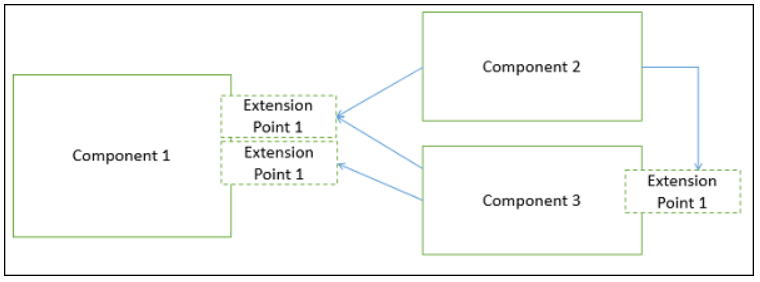
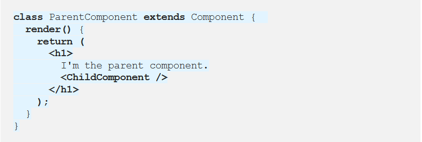
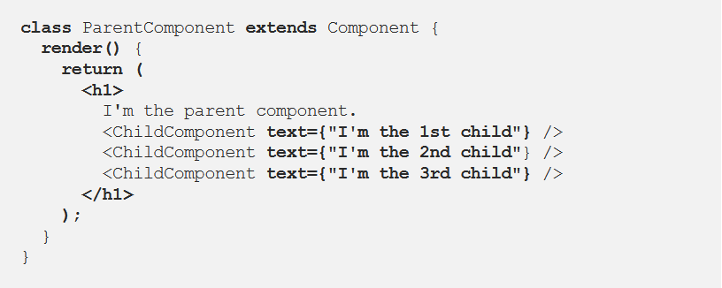

# Introduction to React and Components

## What is a Component?

A component is a modular, portable, replaceable, and reusable set of well-defined functionality that encapsulates its implementation and exporting it as a higher-level interface.

A component is a software object, intended to interact with other components, encapsulating certain functionality or a set of functionalities. It has an obviously defined interface and conforms to a recommended behavior common to all components within an architecture.

## Views of a Component

A component can have three different views.

* Object-oriented view

A component is viewed as a set of one or more cooperating classes. Each problem domain class (analysis) and infrastructure class (design) are explained to identify all attributes and operations that apply to its implementation.

* Conventional view

It is viewed as a functional element or a module of a program that integrates the processing logic, the internal data structures that are required to implement the processing logic.

* Process-related view

In this view, instead of creating each component from scratch, the system is building from existing components maintained in a library.

## Principles of Component−Based Design

A component-level design can be represented by using some intermediary representation (e.g. graphical, tabular, or text-based) that can be translated into source code.

## Component-Level Design Guidelines

Creates a naming conventions for components that are specified as part of the architectural model and then refines or elaborates as part of the component-level model.

## Conducting Component-Level Design

Recognizes all design classes that correspond to the problem domain as defined in the analysis model and architectural model.

## Advantages

* Ease of deployment
* Reduced cost
* Ease of development
* Reusable
* Modification of technical complexity
* Reliability
* System maintenance and evolution
* Independent

## What is “Props” and how to use it in React?

### What is Props?

React is a component-based library which divides the UI into little reusable pieces.

“Props” is a special keyword in React, which stands for properties and is being used for passing data from one component to another.

But the important part here is that data with props are being passed in a uni-directional flow. (one way from parent to child)

### Using Props in React

I will be explaining how to use Props step by step.

1. Firstly, define an attribute and its value(data)
2. Then pass it to child component(s) by using Props
3. Finally, render the Props Data

Understanding React’s approach to data manipulation takes time. I hope my post helps you to become better in React. If you have any questions, comment down below. Next, you can read how to manage data with another special React feature: State.