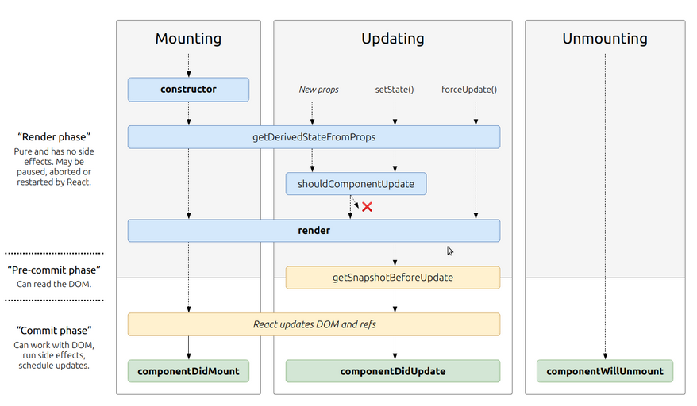

# State and Props

## What are component lifecycle events?

React lets you define components as classes or functions. The methods that you are able to use on these are called lifecycle events. These methods can be called during the lifecycle of a component, and they allow you to update the UI and application states.

## Mounting, Updating, and Unmounting are the three phases of the component lifecycle.

### Mounting

When an instance of a component is being created and inserted into the DOM it occurs during the mounting phase

### Updating

Anytime a component is updated or state changes then it is rerendered.

### Unmounting

The final phase of the lifecycle if called when a component is being removed from the DOM.

* constructor()

The constructor for a React component is called before it is mounted.If the component is a subclass you should call super(props), or the props will be undefined.

* static getDerivedStateFromProps()

This method exists for rare cases where the state relies on changes in props over time.

* render()

Render is the only required method in a class component. It will examine this.props and this.state when called.

* componentDidMount()

This method is invoked immediately after a component is mounted. If you need to load anything using a network request or initialize the DOM, it should go here.

* shouldComponentUpdate()

The default behavior in react is to rerender after every state change. Setting shouldComponentUpdate() to false allows you to prevent this from happening.

* getSnapshotBeforeUpdate()

This is another rarely used method that allows you to capture a picture of the DOM to check it before actually changing anything on the DOM.

* componentDidUpdate()

This method is useful for performing network requests after a change has occurred.

* componentWillUnmount()

This method allows you to clean up the DOM and netwrok requests/ subscriptions.

### UNSAFE Lifecycle Events

UNSAFE_componentWillMount()
UNSAFE_componentWillUpdate()
UNSAFE_componentWillReceiveProps()

These events have lead to a lot of bugs and unintended side effects, so in React 17 these will no longer be able to be used without the UNSAFE tag in front of them. Instead of componentWillMount use ComponentDidMount.

Instead of componentWillReceiveProps use static getDerivedStateFromProps.
Instead of componentWillUpdate us getSnapshotBeforeUpdate.

