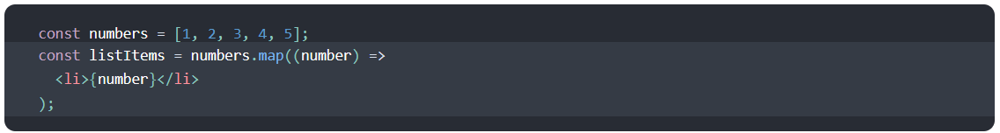

# Passing Functions as Props

## Lists and Keys

### Rendering Multiple Components

You can build collections of elements and include them in JSX using curly braces {}.

Below, we loop through the numbers array using the JavaScript map() function. We return a `<li>` element for each item. Finally, we assign the resulting array of elements to listItems:

We include the entire listItems array inside a `<ul>` element, and render it to the DOM:

### Basic List Component 

Usually you would render lists inside a component.

We can refactor the previous example into a component that accepts an array of numbers and outputs a list of elements.

### Keys

Keys help React identify which items have changed, are added, or are removed. Keys should be given to the elements inside the array to give the elements a stable identity:

### Extracting Components with Keys

Keys only make sense in the context of the surrounding array.

For example, if you extract a ListItem component, you should keep the key on the <ListItem /> elements in the array rather than on the <li> element in the ListItem itself.

### Keys Must Only Be Unique Among Siblings

Keys used within arrays should be unique among their siblings. However, they don’t need to be globally unique. We can use the same keys when we produce two different arrays:

### Embedding map() in JSX

In the examples above we declared a separate listItems variable and included it in JSX:

## Spread Operator

### What is the spread operator?

In JavaScript, spread syntax refers to the use of an ellipsis of three dots (…) to expand an iterable object into the list of arguments.

“When ...arr is used in the function call, it ‘expands’ an iterable object arr into the list of arguments.” — JavaScript.info

The spread operator was added to JavaScript in ES6 (ES2015), just like the rest parameters, which have the same syntax: three magic dots ….

### What is ... used for?

“Spread operator to the rescue! It looks similar to rest parameters, also using ..., but does quite the opposite.” — JavaScript.info

### What else can … do?

The … spread operator is useful for many different routine tasks in JavaScript, including the following:

* Copying an array
* Concatenating or combining arrays
* Using Math functions
* Using an array as arguments
* Adding an item to a list
* Adding to state in React
* Combining objects
* Converting NodeList to an array

In each case, the spread syntax expands an iterable object, usually an array, though it can be used on any interable, including a string.

“The spread operator can expand another item by split an iterable element like a string or an array into individual elements:” — CodinGame.com

The spread operator … is useful for working with arrays and objects in JavaScript. It is a convenient feature added in ES6 (ES2015).

One of my favorite uses of the spread syntax is when combining arrays such as when adding an item to React State.

I also like that it can quickly combine the properties of objects into a new object, though any properties whose names conflict will be lost.

Knowing the spread syntax definitely saves me time when coding, and I recommend using it to all JavaScript developers.