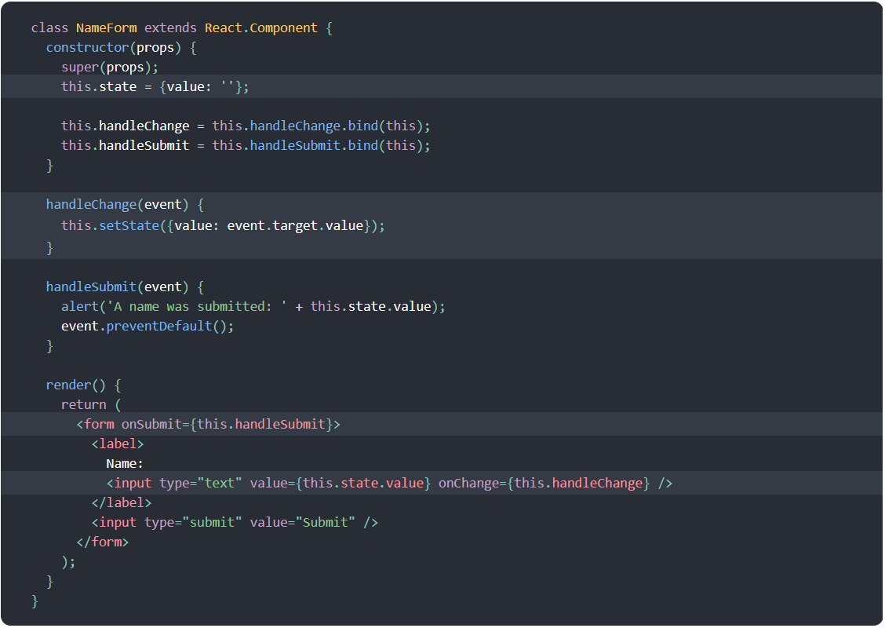
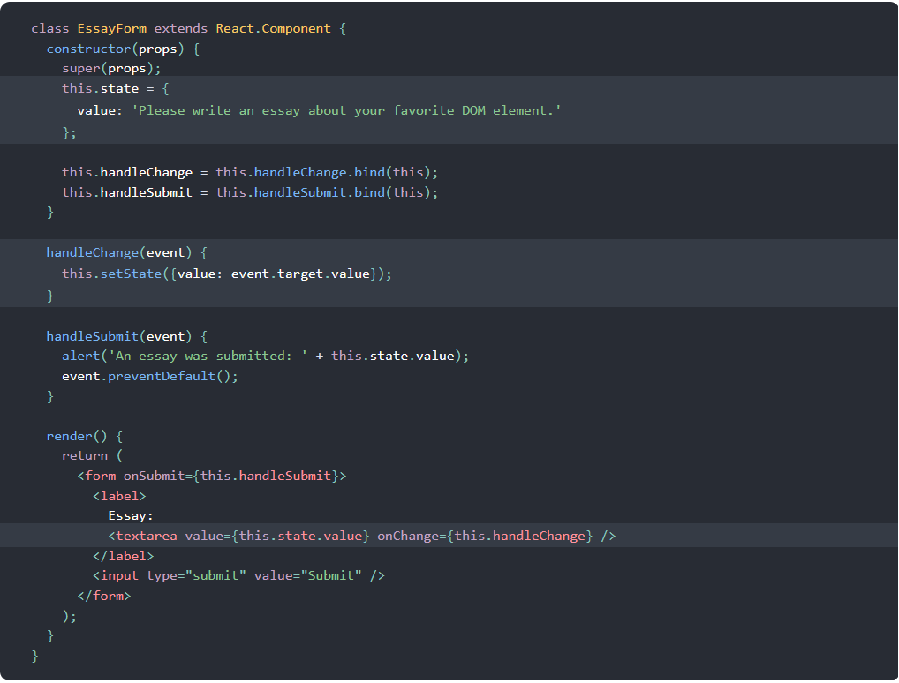
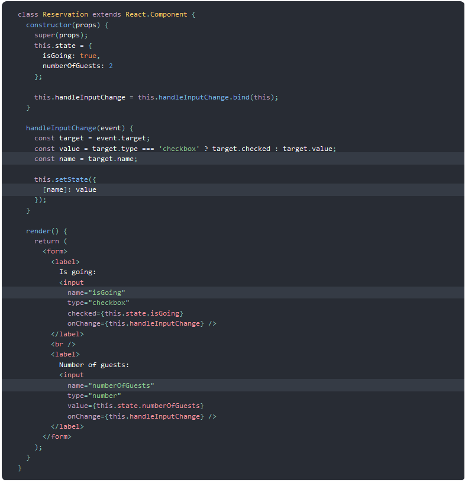
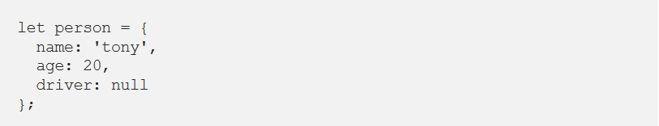
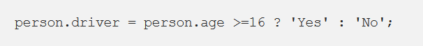
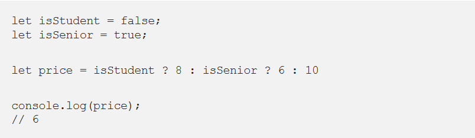

# React and Forms

## Forms

HTML form elements work a bit differently from other DOM elements in React, because form elements naturally keep some internal state.

Form has the default HTML form behavior of browsing to a new page when the user submits the form. If you want this behavior in React, it just works. But in most cases, it’s convenient to have a JavaScript function that handles the submission of the form and has access to the data that the user entered into the form. The standard way to achieve this is with a technique called “controlled components”.

### Controlled Components 

In HTML, form elements such as `<input>`, `<textarea>`, and `<select>` typically maintain their own state and update it based on user input. In React, mutable state is typically kept in the state property of components, and only updated with setState().

We can combine the two by making the React state be the “single source of truth”. Then the React component that renders a form also controls what happens in that form on subsequent user input. An input form element whose value is controlled by React in this way is called a “controlled component”.

Since the value attribute is set on our form element, the displayed value will always be this.state.value, making the React state the source of truth. Since handleChange runs on every keystroke to update the React state, the displayed value will update as the user types.

### The textarea Tag

In React, a `<textarea>` uses a value attribute instead. This way, a form using a `<textarea>` can be written very similarly to a form that uses a single-line input:

### The file input Tag

In HTML, an `<input type="file">` lets the user choose one or more files from their device storage to be uploaded to a server.

Because its value is read-only, it is an uncontrolled component in React. It is discussed together with other uncontrolled components later in the documentation.

### Handling Multiple Inputs

When you need to handle multiple controlled input elements, you can add a name attribute to each element and let the handler function choose what to do based on the value of event.target.name.

### Controlled Input Null Value

Specifying the value prop on a controlled component prevents the user from changing the input unless you desire so. If you’ve specified a value but the input is still editable, you may have accidentally set value to undefined or null.

## The Conditional (Ternary) Operator

### The Conditional (Ternary) Operator

Using a conditional, like an if statement, allows us to specify that a certain block of code should be executed if a certain condition is met.

Consider the following example:

We have a person object that consists of a name, age, and driver property.

We want to test if the age of our person is greater than or equal to 16. If this is true, they’re old enough to drive and driver should say 'Yes'. If this is not true, driver should be set to 'No'.

This could be done with only one line:

### The Conditional (Ternary) Operator

condition ? value if true : value if false

Here’s what you need to know:

1. The condition is what you’re actually testing. The result of your condition should be true or false or at least coerce to either boolean value.
2. A ? separates our conditional from our true value. Anything between the ? and the : is what is executed if the condition evaluates to true.
3. Finally a : colon. If your condition evaluates to false, any code after the colon is executed.

### Example — Nested Ternary

