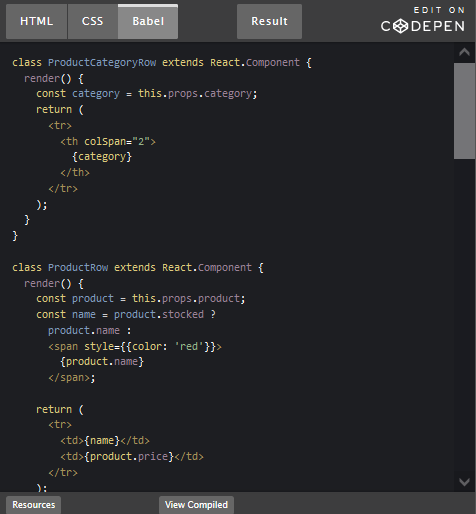

# Putting it all together

## Start With A Mock

### Step 1: Break The UI Into A Component Hierarchy

The first thing you’ll want to do is to draw boxes around every component (and subcomponent) in the mock and give them all names. If you’re working with a designer.

You’ll see here that we have five components in our app. We’ve italicized the data each component represents. The numbers in the image correspond to the numbers below.

1. FilterableProductTable (orange): contains the entirety of the example
2. SearchBar (blue): receives all user input
3. ProductTable (green): displays and filters the data collection based on user input
4. ProductCategoryRow (turquoise): displays a heading for each category
5. ProductRow (red): displays a row for each product

If you look at ProductTable, you’ll see that the table header (containing the “Name” and “Price” labels) isn’t its own component. This is a matter of preference, and there’s an argument to be made either way. For this example, we left it as part of ProductTable because it is part of rendering the data collection which is ProductTable’s responsibility. However, if this header grows to be complex (e.g., if we were to add affordances for sorting), it would certainly make sense to make this its own ProductTableHeader component.

### Step 2: Build A Static Version in React

Now that you have your component hierarchy, it’s time to implement your app. The easiest way is to build a version that takes your data model and renders the UI but has no interactivity. It’s best to decouple these processes because building a static version requires a lot of typing and no thinking, and adding interactivity requires a lot of thinking and not a lot of typing. We’ll see why.

To build a static version of your app that renders your data model, you’ll want to build components that reuse other components and pass data using props. props are a way of passing data from parent to child. If you’re familiar with the concept of state, don’t use state at all to build this static version. State is reserved only for interactivity, that is, data that changes over time. Since this is a static version of the app, you don’t need it.

### Step 3: Identify The Minimal (but complete) Representation Of UI State

To make your UI interactive, you need to be able to trigger changes to your underlying data model. React achieves this with state.

To build your app correctly, you first need to think of the minimal set of mutable state that your app needs. The key here is DRY: Don’t Repeat Yourself. Figure out the absolute minimal representation of the state your application needs and compute everything else you need on-demand. For example, if you’re building a TODO list, keep an array of the TODO items around; don’t keep a separate state variable for the count. Instead, when you want to render the TODO count, take the length of the TODO items array.

### Step 4: Identify Where Your State Should Live

OK, so we’ve identified what the minimal set of app state is. Next, we need to identify which component mutates, or owns, this state.

Remember: React is all about one-way data flow down the component hierarchy. It may not be immediately clear which component should own what state. This is often the most challenging part for newcomers to understand, so follow these steps to figure it out:

For each piece of state in your application:

* Identify every component that renders something based on that state.
* Find a common owner component (a single component above all the components that need the state in the hierarchy).
* Either the common owner or another component higher up in the hierarchy should own the state.
* If you can’t find a component where it makes sense to own the state, create a new component solely for holding the state and add it somewhere in the hierarchy above the common owner component.

### Step 5: Add Inverse Data Flow

