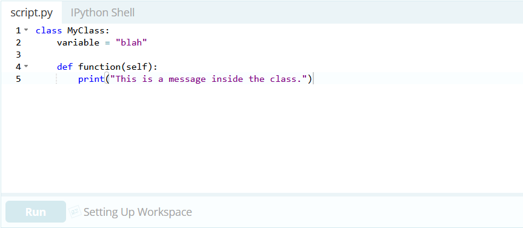
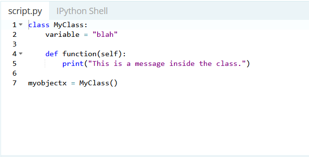
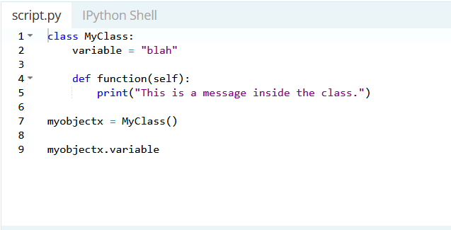
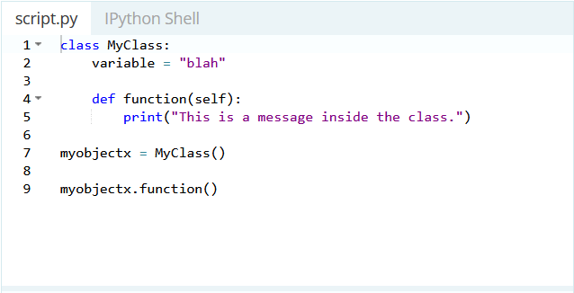

# Classes and Objects

Objects are an encapsulation of variables and functions into a single entity. Objects get their variables and functions from classes. Classes are essentially a template to create your objects.

We'll explain why you have to include that "self" as a parameter a little bit later. First, to assign the above class(template) to an object you would do the following:

## Accessing Object Variables

To access the variable inside of the newly created object "myobjectx" you would do the following:

## Accessing Object Functions

To access a function inside of an object you use notation similar to accessing a variable:

# Thinking Recursively in Python

## Recursive Functions in Python

Now that we have some intuition about recursion, let’s introduce the formal definition of a recursive function. A recursive function is a function defined in terms of itself via self-referential expressions.

This means that the function will continue to call itself and repeat its behavior until some condition is met to return a result. All recursive functions share a common structure made up of two parts: base case and recursive case.

## Maintaining State

When dealing with recursive functions, keep in mind that each recursive call has its own execution context, so to maintain state during recursion you have to either:

* Thread the state through each recursive call so that the current state is part of the current call’s execution context
* Keep the state in global scope

## Recursive Data Structures in Python

A data structure is recursive if it can be defined in terms of a smaller version of itself. A list is an example of a recursive data structure. Let me demonstrate. Assume that you have only an empty list at your disposal.

## Naive Recursion is Naive

The Fibonacci numbers were originally defined by the Italian mathematician Fibonacci in the thirteenth century to model the growth of rabbit populations. Fibonacci surmised that the number of pairs of rabbits born in a given year is equal to the number of pairs of rabbits born in each of the two previous years, starting from one pair of rabbits in the first year.

